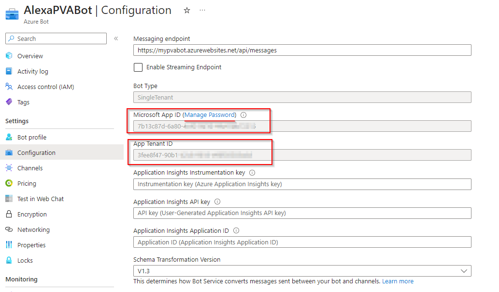
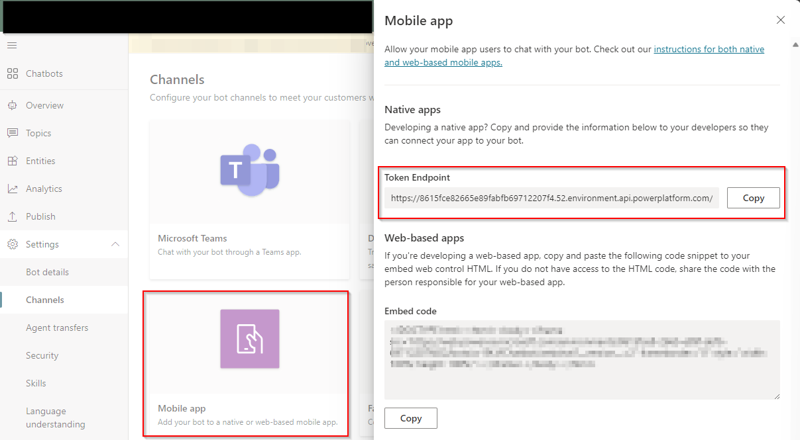
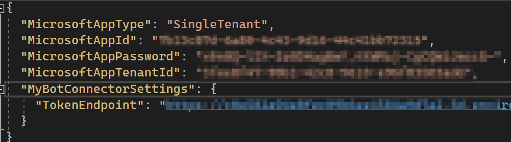
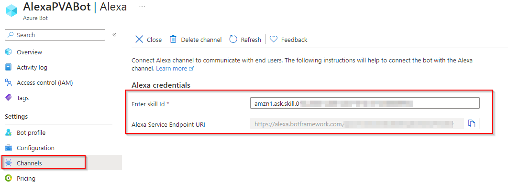

# Alexa - Power Virtual Agents Relay Bot
Relay Bot that allows to connect an Amazon Alexa Skill to a Power Virtual Agents chatbot.

The following [article](https://learn.microsoft.com/en-us/power-virtual-agents/publication-connect-bot-to-azure-bot-service-channels) on Microsoft Learn explains the concept of what a Relay Bot is.

Although there should be a relay bot sample code [here](https://github.com/microsoft/PowerVirtualAgentsSamples/tree/master/RelayBotSample), it has been discontinued, as in a near future it will be possible to publish a [Power Virtual Agents chatbot and use it as a skill](https://learn.microsoft.com/en-us/power-virtual-agents/advanced-use-pva-as-a-skill).

While this is not possible, I created this .NET project that will create an Azure Bot that connects an Amazon Alexa Skill and a Power Virtual Agents chatbot. These are the steps to follow in order to publish our relay bot:

1. Deploy the project to Azure to create all needed resources.
2. When the project is deployed, go to the Azure portal and select the Azure Bot created resource, as we need to copy Microsoft App ID, App Tenant ID and Password and paste those in the appsettings.json file of our project.

3. Go to the Power Virtual Agents chatbot that you want to use, select channels, Mobile app, and then copy the Token Endpoint value. That value is also needed in the appsettings.json file of our project.

4. Once we have configured all the values in the appsettings.json file, we can deploy again our solution to Azure.

5. Finally, we have to configure Alexa channel in our published bot in Azure. In order to do so, we have to go to Channels, select Alexa, and then add the Alexa Skill Id (it was created when you created the skill in the Amazon Alexa Developer console). The Alexa Service Endpoint URI is the one that we need to use when we configure the Skill in the Amazon Alexa Developer console.

Now it should be possible to use an Amazon Alexa Skill that interacts with a Power Virtual Agent chatbot.

Thanks to [Xavi Segura](https://github.com/xaviseghttps://github.com/xaviseguraura) for his support on building the relay bot.